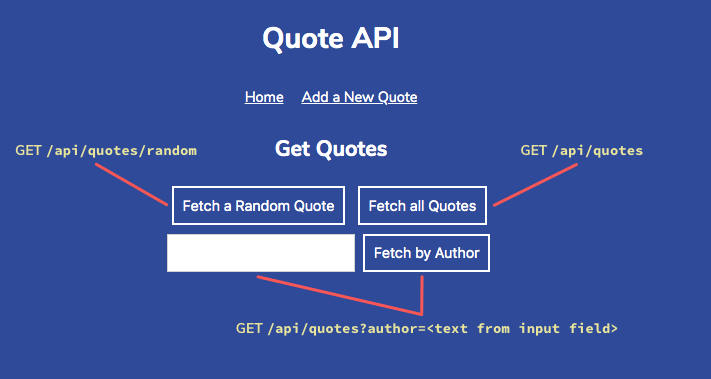

# QUOTEAPI

## General info

Codecademy Challenge Project practicing task for Full-Stack Engineer Course.

## Description

In this project, created a small Express.js web API to store and serve different quotes about computers, coding, and technology.

## Screenshot

## Technolgies

+ Node.js
+ Express.js
+ Html 5
+ Css 3

## Setup

To run your API on your computer, you will need to install [Node.js](https://nodejs.org). Once you have an editor an Node.js set up, download the project, unzip it, navigate to that folder in your terminal and run npm install to install Express before trying to start up your server.

## Run

node server.js

## Created

2022

## License

[MIT](https://choosealicense.com/licenses/mit/)